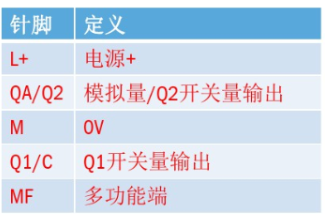
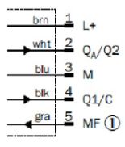
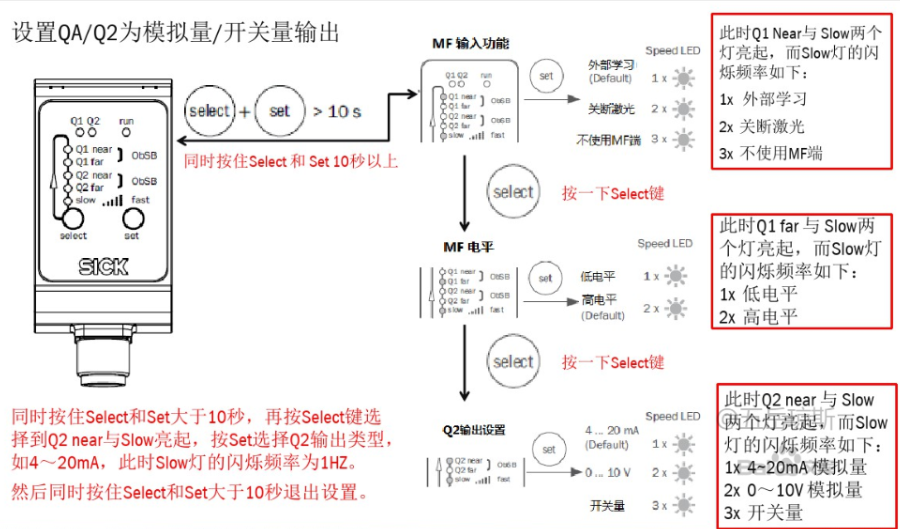
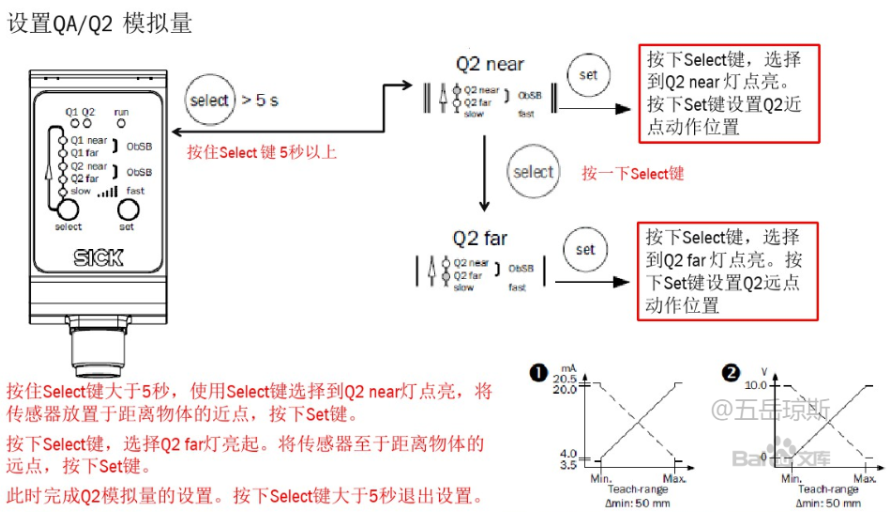

# WTR_DT35_HardWare_V1_1

本固件用于 WTR DT35 转接板。其余 DT35 转接板或者 ADS1256 转接板可以根据源码进行参考。

## 1. 固件烧录说明

使用 `/Src` 目录下的任意二进制文件，使用 STM32 Utility 工具即可进行固件烧录。

## 2. 串口输出

串口采用 RS485 接口进行输出，MCU 通信时请使用 RS485 -> TTL 转换器。

串口协议采用自定义串口协议，共 24 Byte：

| Byte0      | Byte1      | Byte2       | Byte3-Byte6                      | Byte7       | Byte8-Byte11 | Byte12 | Byte13-Byte16 |Byte17|Byte18-Byte21| Byte22| Byte23|
| ---------- | ---------- | ----------- | -------------------------------- | ----------- | ------------ | ------ | ------------- | ------------- | ------------- | ------------- | ------------- |
| 0xAA(帧头) | 0xBB(帧头) | 0x01(通道1) | 4 Byte(通道1 32位数据，高位先行) | 0x02(通道2) |  4 Byte(通道2 32位数据，高位先行)  | 0x03(通道3) | 4 Byte(通道3 32位数据，高位先行)  |0x03(通道3) | 4 Byte(通道3 32位数据，高位先行)| 0xCC(帧尾) | 0xDD(帧尾) |

串口输出频率为 200 Hz。

串口输出的 4 通道 32 位数据为 ADS1256 的原始采集数据，进行距离测量时，根据自己设定的距离测量范围进行测量转换。

| 数据范围         | Channel_min  | Channel_max  |
| ---------------- | ------------ | ------------ |
| 距离范围         | Distance_min | Distance_max |
| 差分电压输入范围 | V_min(0V)    | V_max(10V)   |

## 3. DT35 使用说明

### 接线

> 四线：两个GND线(一个用于供电，一个用于电压模拟输出地，蓝线)，24V电源输入线（棕线），模拟信号输出线（取电压信号，白线)

### 校准配置

- 恢复出厂设置：

  长按 Select 键后上电，观察到 Q1/Q2 不亮，间隔一会后左侧5个灯闪烁，即恢复出厂设置；

- 模式设置：

  上电后长按 Select + Set 键直至 Q1 near + Slow 灯共同亮起。

  选择电压输出。

  

- 远点和近点设置

  
